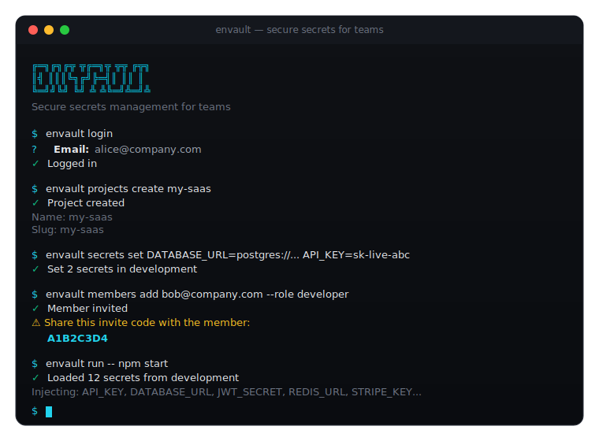
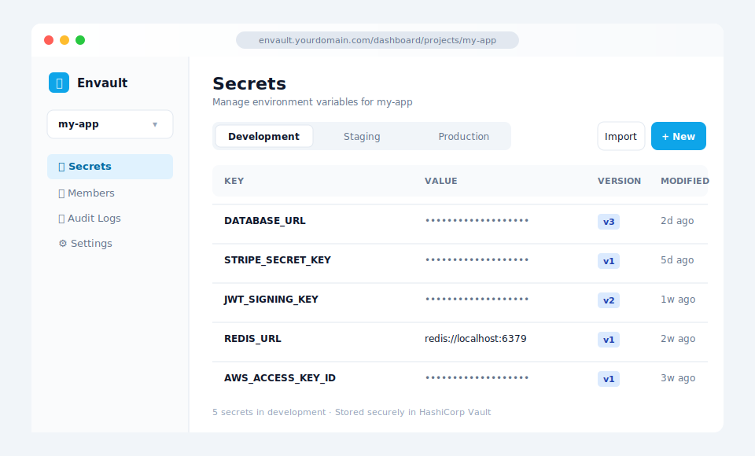
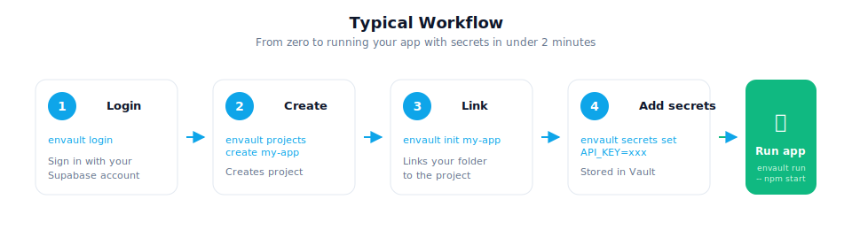
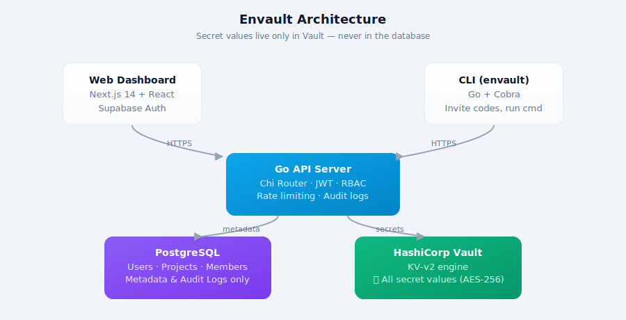

# Envault

**Self-hosted secrets manager for teams.** Store secrets in HashiCorp Vault, control access with roles, and inject them into any app — from a dashboard or CLI.

[](https://go.dev)
[](https://nextjs.org)
[](https://www.vaultproject.io)
[](LICENSE)

<p align="center">
  
</p>

---

## What is Envault?

Teams share secrets through Slack DMs, `.env` files in repos, or sticky notes. Envault replaces all of that:

- Secrets are stored in **HashiCorp Vault** (never in the database)
- Team members get **role-based access** (admin, developer, CI)
- Every action is logged in a **full audit trail**
- Manage secrets from a **web dashboard** or a **powerful CLI**
- One command to inject secrets into any process: `envault run -- npm start`

<p align="center">
  
</p>

---

## Get Started (5 minutes)

You need **Docker** and a free **[Supabase](https://supabase.com)** account (for authentication).

### Step 1: Create a Supabase project

1. Go to [supabase.com](https://supabase.com) and create a free project
2. Go to **Project Settings > API** and note down:
   - **Project URL** (looks like `https://abcdefgh.supabase.co`)
   - **anon public key** (a long `eyJ...` string)
   - **Project Reference ID** (the `abcdefgh` part from the URL)

### Step 2: Clone and configure

```bash
git clone https://github.com/bhartiyaanshul/envault.git
cd envault
cp .env.example .env
```

Open `.env` and replace the 4 Supabase placeholders with your values:

```env
JWKS_URL=https://YOUR_REF.supabase.co/auth/v1/.well-known/jwks.json
JWT_ISSUER=https://YOUR_REF.supabase.co/auth/v1
NEXT_PUBLIC_SUPABASE_URL=https://YOUR_REF.supabase.co
NEXT_PUBLIC_SUPABASE_ANON_KEY=your-anon-key-here
```

> That's the only configuration needed. Everything else has working defaults.

### Step 3: Start

```bash
docker compose up -d --build
```

Wait about 30 seconds, then open **http://localhost:3000** and sign up.

| Service     | URL                           |
|-------------|-------------------------------|
| Dashboard   | http://localhost:3000          |
| API         | http://localhost:8080          |
| Vault UI    | http://localhost:8200          |

To stop: `docker compose down`
To see logs: `docker compose logs -f`

---

## Install the CLI

The CLI lets you manage everything from your terminal without opening the dashboard.

```bash
# From the repo root
go install ./cmd/envault
```

> Make sure `~/go/bin` is in your PATH. If `envault` gives "command not found", run:
> ```bash
> echo 'export PATH="$HOME/go/bin:$PATH"' >> ~/.zshrc
> source ~/.zshrc
> ```

### Login

```bash
# Set your Supabase credentials (one time)
export ENVAULT_SUPABASE_URL=https://YOUR_REF.supabase.co
export ENVAULT_SUPABASE_ANON_KEY=your-anon-key-here

# Sign up (first time) or login
envault signup
envault login
```

<p align="center">
  
</p>

### Create a project

```bash
envault projects create my-app
```

### Link a project to your directory

```bash
cd ~/code/my-app
envault init my-app
```

This creates a `.envault.yaml` file in the directory. All subsequent commands use it automatically.

### Manage secrets

```bash
# Add secrets
envault secrets set DATABASE_URL=postgres://localhost/mydb
envault secrets set API_KEY=sk-live-abc123 REDIS_URL=redis://localhost

# List secrets
envault secrets

# Get a secret value
envault secrets get DATABASE_URL

# Delete a secret
envault secrets delete OLD_KEY

# Use a different environment
envault secrets --env production
envault secrets set API_KEY=sk-prod-xyz --env production
```

### Run your app with secrets

```bash
# Secrets are injected as environment variables
envault run -- npm start
envault run -- python app.py
envault run -- docker compose up

# Specify environment
envault run --env production -- node server.js
```

Your app reads secrets from `process.env` / `os.environ` as normal. No SDK needed.

### Sync with .env files

```bash
# Pull all secrets to a .env file
envault env pull
envault env pull --env production -o .env.production

# Push a .env file to Envault
envault env push
envault env push --env staging -i .env.staging
```

### Invite team members

No email server needed. Envault uses **invite codes** that you share directly.

```bash
# Invite someone (you'll get an 8-character code)
envault members add alice@company.com --role developer
# Output: Share this invite code: A1B2C3D4

# They run:
envault signup          # create account
envault join A1B2C3D4   # accept invite

# List members
envault members

# Remove someone
envault members remove alice@company.com
```

### Quick reference

```bash
envault                  # Show help
envault status           # Show current project & auth status
envault whoami           # Show logged-in user
envault login            # Sign in
envault logout           # Sign out
envault projects         # List all projects
envault projects create  # Create a new project
envault projects delete  # Delete a project
envault init <slug>      # Link directory to a project
envault secrets          # List secrets
envault secrets set      # Set secrets (KEY=VALUE)
envault secrets get      # Get a secret value
envault secrets delete   # Delete a secret
envault run -- <cmd>     # Run command with injected secrets
envault env pull         # Pull secrets to .env file
envault env push         # Push .env file to Envault
envault members          # List team members
envault members add      # Invite a member (returns invite code)
envault members remove   # Remove a member
envault join <code>      # Accept an invite code
```

---

## Roles & Permissions

| Permission         | Admin | Developer | CI       |
|--------------------|-------|-----------|----------|
| Read secrets       | All   | All       | staging, production |
| Write secrets      | All   | dev, staging | No    |
| Delete secrets     | All   | dev, staging | No    |
| Manage members     | Yes   | No        | No       |
| Delete project     | Yes   | No        | No       |
| View audit logs    | Yes   | Yes       | Yes      |

---

## Architecture

<p align="center">
  
</p>

**Key design decision:** Secret values are stored **only** in Vault. PostgreSQL stores metadata (who created what, team memberships, audit logs). Even a full database leak exposes zero secrets.

---

## Development Setup

If you want to work on Envault itself:

```bash
# Start just the infrastructure
docker compose up -d postgres vault vault-init

# Run the API server with hot reload
cp .env.example .env    # configure Supabase values
source .env
go install github.com/air-verse/air@latest
air                     # watches for changes, auto-restarts

# In another terminal, run the dashboard
cd web && npm install && npm run dev

# Build the CLI
go install ./cmd/envault
```

| Command           | What it does                    |
|-------------------|---------------------------------|
| `make build`      | Build API server + CLI          |
| `make test`       | Run tests with coverage         |
| `make lint`       | Run golangci-lint               |
| `docker compose up -d`   | Start full stack          |
| `docker compose down`    | Stop everything           |

---

## Deploying to Production

### Option 1: Docker Compose on a VPS

Works on any machine with Docker (DigitalOcean, Hetzner, AWS EC2, etc).

```bash
git clone https://github.com/bhartiyaanshul/envault.git
cd envault
cp .env.example .env
# Edit .env with production values (strong passwords, real domain, Supabase credentials)
docker compose up -d --build
```

Put Caddy or nginx in front for HTTPS:

```
# Caddyfile
envault.yourdomain.com {
    reverse_proxy localhost:3000
}
api.envault.yourdomain.com {
    reverse_proxy localhost:8080
}
```

### Option 2: Free tier (Vercel + Render + Supabase)

See [DEPLOY.md](DEPLOY.md) for a step-by-step guide to deploy on free tiers.

### Production checklist

- [ ] Strong `DATABASE_PASSWORD` (not the default)
- [ ] Unique `VAULT_TOKEN` (not `dev-root-token`)
- [ ] `CORS_ALLOWED_ORIGINS` set to your actual domain
- [ ] HTTPS enabled via reverse proxy
- [ ] Vault using file/raft storage (not dev mode)

---

## API Endpoints

All endpoints under `/api/v1` require `Authorization: Bearer <jwt>`.

| Method   | Endpoint                                   | Description          |
|----------|--------------------------------------------|----------------------|
| `GET`    | `/healthz`                                 | Health check         |
| `POST`   | `/api/v1/projects`                         | Create project       |
| `GET`    | `/api/v1/projects`                         | List projects        |
| `GET`    | `/api/v1/projects/{slug}`                  | Get project          |
| `DELETE` | `/api/v1/projects/{slug}`                  | Delete project       |
| `GET`    | `/api/v1/projects/{slug}/secrets`          | List secret keys     |
| `POST`   | `/api/v1/projects/{slug}/secrets`          | Set a secret         |
| `POST`   | `/api/v1/projects/{slug}/secrets/bulk`     | Bulk set secrets     |
| `GET`    | `/api/v1/projects/{slug}/secrets/{key}`    | Get secret value     |
| `DELETE` | `/api/v1/projects/{slug}/secrets/{key}`    | Delete a secret      |
| `GET`    | `/api/v1/projects/{slug}/members`          | List members         |
| `POST`   | `/api/v1/projects/{slug}/members`          | Invite member        |
| `DELETE` | `/api/v1/projects/{slug}/members/{id}`     | Remove member        |
| `POST`   | `/api/v1/invite/accept`                    | Accept invite code   |
| `POST`   | `/api/v1/projects/{slug}/rotate`           | Rotate credentials   |
| `GET`    | `/api/v1/projects/{slug}/audit`            | Audit logs           |

---

## Project Structure

```
envault/
├── cmd/server/          # API server entry point
├── cmd/envault/         # CLI entry point
├── internal/
│   ├── cli/             # CLI commands
│   ├── config/          # Configuration
│   ├── db/              # Database connection
│   ├── models/          # Data models
│   ├── repository/      # Data access layer
│   ├── server/
│   │   ├── handlers/    # HTTP handlers
│   │   └── middleware/  # Auth, RBAC, rate limiting
│   ├── service/         # Business logic
│   └── vault/           # Vault client
├── migrations/          # SQL migrations (embedded)
├── web/                 # Next.js dashboard
├── docker-compose.yml   # Full stack Docker setup
├── Dockerfile           # Go API build
├── Makefile             # Build targets
└── setup.sh             # Quick setup script
```

---

## License

MIT - see [LICENSE](LICENSE)
